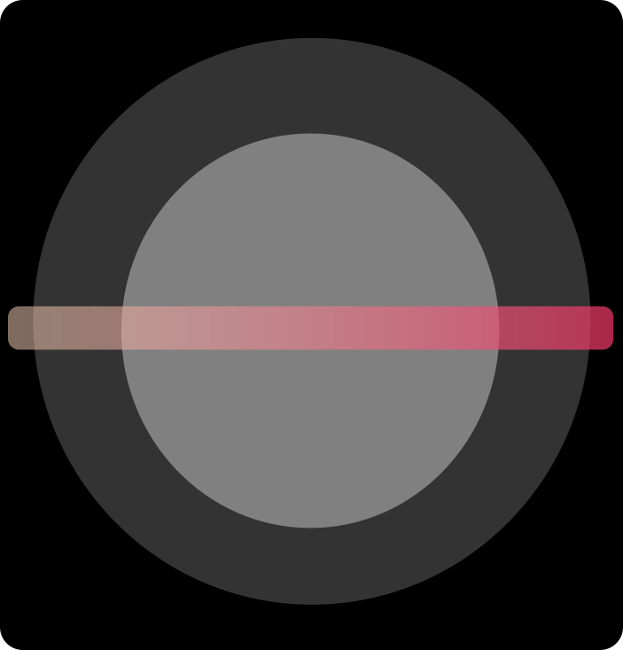

# Ruty Game Engine
<br>
Ruty is a modern, 2D game engine written in Rust, built on top of [macroquad](https://github.com/not-fl3/macroquad). It demonstrates a component-based architecture inspired by engines like Unity, making it easy to add, remove, and combine behaviors for game objects.

## 🌟 Features

### Core Engine
- **Component System**: Attach modular behaviors (gravity, friction, collision, force, etc.) to game objects
- **Physics Simulation**: Advanced physics with gravity, friction, and force application
- **Collision Handling**: Sophisticated collision detection and resolution with slope support
- **Input Handling**: Robust keyboard and mouse input management
- **Rendering**: High-performance 2D rendering with support for shapes and text

### UI System
- **Modern UI Components**: Buttons, panels, inputs, sliders, checkboxes, and more
- **Theme System**: Consistent styling with dark/light mode support
- **Animation System**: Smooth transitions and effects for all UI elements
- **Event System**: Robust event handling with callbacks
- **Z-Ordering**: Proper layering of UI elements

### Physics Features
- **Gravity**: Configurable gravity strength and direction
- **Friction**: Surface and air friction with customizable coefficients
- **Collision**: AABB collision detection with bounce and slope support
- **Force System**: Support for both temporary and permanent forces
- **Constraint System**: Create complex physics-based shapes and joints

## 📦 Project Structure

```
src/
├── basics/           # Core game mechanics
│   ├── collision.rs  # Collision detection and response
│   ├── force.rs      # Force application system
│   ├── friction.rs   # Friction simulation
│   └── gravity.rs    # Gravity implementation
├── objects/          # Game objects
│   ├── quad.rs       # Basic rectangular object
│   ├── point.rs      # Physics point for constraints
│   ├── shapes.rs     # Pre-built shape generators
│   └── ui.rs         # UI component system
├── utils/            # Utility functions
│   ├── font_text.rs  # Font loading and text rendering
│   └── screen.rs     # Screen management
├── test/             # Test framework
│   ├── mod.rs        # Test module definitions
│   └── ui_test.rs    # UI component tests
└── main.rs           # Main application entry
```

## 🚀 Quick Start

```rust
use ruty::objects::ui::{Theme, UiButton, UiPanel};
use ruty::basics::{Gravity, Collision, Friction};

// Create a game object with physics
let mut cube = Quad::new(200.0, 0.0, 50.0, 50.0, WHITE);
cube.add_component(Box::new(Gravity::new(0.5)));
cube.add_component(Box::new(Collision::new(0.8, 0.9)));
cube.add_component(Box::new(Friction::new(0.85)));

// Create a UI panel
let theme = Theme::default();
let mut panel = UiPanel::new(
    20.0, 20.0, 300.0, 500.0,
    theme.clone(),
    Some("Game UI".to_string())
);

// Add a button
let button = UiButton::new(
    "Click Me",
    40.0, 60.0, 220.0, 40.0,
    18, font.clone(), theme.clone(),
    Some(Box::new(|| println!("Button clicked!")))
);
panel.add_element(Box::new(button));
```

## 🎮 Controls

- **A/D**: Move left/right
- **Space**: Jump (when on ground)
- **Shift**: Sprint
- **Mouse**: Interact with UI elements

## 🛠️ Building & Running

Make sure you have Rust and Cargo installed. Then run:

```bash
cargo run
```

## 📚 Documentation

For detailed documentation, see the [docs.md](docs.md) file.

## 🔧 Dependencies
- [macroquad](https://crates.io/crates/macroquad) - Graphics, input, and windowing
- [image](https://crates.io/crates/image) - Image handling (optional)

## 📝 License

MIT License. See [LICENSE](LICENSE) for details.

---

*Ruty Game Engine – Building games with Rust, one component at a time!*
